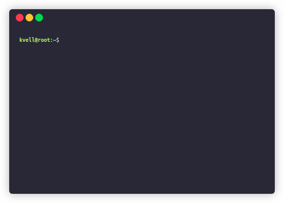

# Create-kvell-app

## Creating an application

To setup a kvell application, you just need to run the following command

```sh
npx create-kvell-app example-app
```


**Note**: [npx](https://medium.com/@maybekatz/introducing-npx-an-npm-package-runner-55f7d4bd282b) comes with npm 5.2+ and higher. If you use npm 5.1 or earlier, you need to install `create-kvell-app` globally instead:


```sh
npm i -g create-kvell-app
```

Once installed, you can create a kvell application by running:

```sh
create-kvell-app example-app
```

## Running the server

Now, you can change your directory to `example-app` and run the application in `development` mode by running:

```sh
cd example-app
npm start
```

That's it! This will start you server on [http://localhost:5001](http://localhost:5001).



## Optional Installation Method

You can also create an application using the `npm init` script.

```sh
npm init kvell-app example-app
```

For complete docs of Kvell, visit [Kvell Docs](https://kvelljs.now.sh/)
